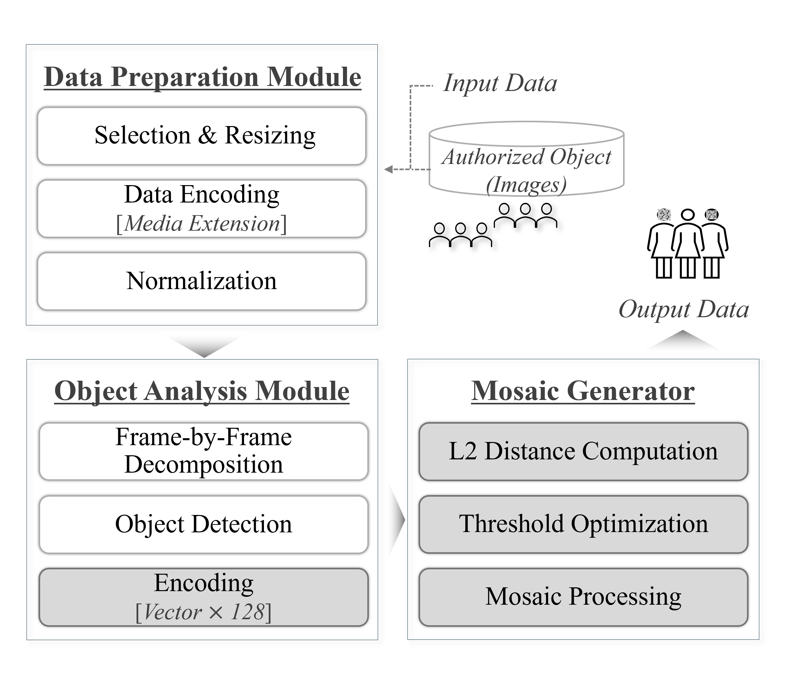

# [ TeeMo ] 티끌 모자이크

허가되지 않은 인물들의 얼굴을 실시간으로 모자이크 처리할 수 있는 모바일 앱입니다.

사진이나 동영상에서 특정 얼굴을 식별한 후 해당 얼굴 객체에 모자이크 처리한 결과물을 사용자에게 제공하며, 이를 통해 개인 권리 침해 방지와 법적 책임 예방에 대한 효과적인 대응 방안을 제공하고자 합니다.

<br/>

## 목차
* [개요](#개요)
* [기술 스택 및 개발 환경](#기술-스택-및-개발-환경)
* [비인가 인원 모자이크 처리](#비인가-인원-모자이크-처리)
* [주요 기능](#주요-기능능)

<br/>

## 개요

### 팀 소개

* **최재연** : <wasid4598@naver.com>
* 김지연 : <wusemr2@naver.com>
* 김하늘 : <redlight02@naver.com>
* 민수지 : <tnwl3109@naver.com>

<br/>

### 프로젝트 소개

* 프로젝트 명
  - **비인가 인원 모자이크 처리** 기술을 적용한 모바일 애플리케이션
  - Mobile Application with **Mosaic Processing** by **Unauthorized Objects**
 
* 프로젝트 기간
  - 2024.03 ~ 2024.06

* 프로젝트 목표
  - **촬영 대상**<sup> 인가 인원 </sup>의 각 얼굴을 정확하게 식별합니다.
  - **미디어 파일**<sup> 사진, 동영상 </sup>업로드 시 등장하는 모든 인원의 얼굴이 식별되며,
    **모자이크를 적용하지 않을 사람들**<sup> 촬영 대상(=인가 인원) </sup>을 선택할 수 있습니다.
  - 실시간 촬영 시 **촬영 대상 외의 인물**<sup> 비인가 인원 </sup>의 얼굴에 모자이크 처리가 실시간으로 적용됩니다.
    
<br/>

## 기술 스택 및 개발 환경

### Environment


<br/>
[](https://www.nvidia.com/)
<br/>


### Development


<br/>


### Libarary


### Communication


### Versions

| 기술 / 환경          | 버전         |
|-------------------|-------------|
| **OS**            | Windows 10  |
| **Python**        | 3.8.12      |
| **CMake**         | 3.29.3      |
| **dlib**          | 19.24.99    |
| **face_recognition** | 1.3.0    |
| **CUDA**          | 10.2        |
| **cuDNN**         | 8.7.0       |
| **GPU**           | GTX 1660    |
| **React Native**  | 0.74.1      |
| **Expo SDK**      | 51.0.1      |

<br/>

## 비인가 인원 모자이크 처리

### 개념 모델


* **데이터셋** Data Preparation Module
  + **인가 객체의 얼굴 사진**
    - 각 객체당 최소 1개 ~ 5개의 사진으로 구성<sup> [1] </sup>

  + **모자이크 처리 대상 미디어**
    - 사진, 동영상 혹은 실시간으로 촬영 중인 카메라 화면<sup> [2] </sup>
    - 확장자를 설정하여 모델에서 분석하기 적합한 형식의 데이터로 가공<sup> [3] </sup>
    
> [1] 각도나 표정에 따른 얼굴 모양의 변화를 고려하여 인식의 정확도를 높임<br/>
> [2] 입력 데이터셋의 크기가 큰 경우 GPU 메모리 사용량이 크게 증가하므로, GPU 환경에 맞게 조정하는 전처리 과정 필요<br/>
> [3] 사진 - JPEG, 동영상 - MP4

<br/>

* **얼굴 객체 탐지 및 특징 추출** Object Analysis Module
  + 얼굴 객체 탐지
    - **미디어의 각 프레임**에서 존재하는 모든 얼굴 객체를 탐지
    - 탐지된 얼굴 객체 위치를 **좌표 형태**로 반환

  + 얼굴 특징 추출
    - **인가 객체**<sup> 촬영 대상 </sup>**의 얼굴 사진**과 **모자이크 처리 대상 미디어**에서 얼굴 객체의 특징을 추출
    - 얼굴 객체의 특징을 **128차원의 인코딩 벡터** 형태로 반환

<br/>
   
* **얼굴 객체 구분 및 모자이크 처리** Mosaic Generator
  + 얼굴 객체 구분
    - 인가 객체와 모자이크 대상 미디어 내 모든 객체 간의 거리 계산
    - 거리가 일정 임계값 이상일 경우 해당 객체를 비인가 객체로 판단

  + 모자이크 처리
    - 비인가 객체로 판단된 얼굴 객체 영역에 블러 처리

> 비인가 객체에만 모자이크 처리를 하기 위해 비인가 객체를 식별하는 과정이 필요<br/>
> 모자이크 처리 대상 미디어가 영상인 경우 이 과정이 모든 프레임에 대해 반복적으로 수행되고, 각 프레임을 합쳐 최종적으로 모자이크 처리된 비디오를 생성

<br/>

### 활용 기술

+ **dlib의 MMOD**<sup> Max-Margin Object Detection</sup> **모델**
  - 얼굴 객체 탐지에 특화된 딥러닝 기반 객체 탐지 모델
  - CNN<sup> Convolutional Neural Networks </sup>을 사용해 분류 정확도를 높임
  - 얼굴 객체의 위치를 탐지하고 벡터를 추출하는 데에 정확도를 높이기 위해 사용

<br/>

+ **face_recognition 라이브러리** [face_recognition GitHub Repository](https://github.com/ageitgey/face_recognition)
  - dlib를 기반으로 한 라이브러리
  - 얼굴 인식 구현을 위한 인터페이스 제공
  - 얼굴 객체 탐지와 인코딩 벡터 추출을 위해 사용

<br/>

+ **L2 Distance**
  - 두 점 사이의 직선거리를 측정하는 방법으로, 유클리드 거리<sup> Euclidean Distance </sup>로도 알려져 있음
  - 128차원의 인코딩 벡터 간의 거리를 계산하기 위해 사용

<br/>

+ **OpenCV 라이브러리**
  - Gaussian Blur 필터 사용
  - 비인가 객체에 모자이크 처리를 수행하기 위해 사용

<br/>

### 활용 예제

+ **얼굴 객체 탐지**

  ``` python
  reference_face_locations = face_recognition.face_locations(reference_image, model ='cnn')
  ```
  
  - 함수 : **face_recognition.facec_location(<탐지할 미디어>, <모델>)**<br/>

> **face_locations 함수**는 이미지를 인자로 받아 이미지 내에서 탐지된 얼굴 객체의 위치를 **얼굴 주변에 위치한 경계상자의 좌표 형태**로 반환한다.<br/>
> face_recognition의 함수는 기본적으로 HOG<sup> Histogram of Oriented Gradients</sup> 기반의 얼굴 객체 탐지 모델을 사용한다.<br/>
> 본 프로젝트에서는 탐지 정확도를 높이기 위해 model='cnn'을 인자로 전달하여 CNN 기반 MMOD 모델을 사용하도록 설정했다. (생략 가능)<br/>
> **GPU 가속**을 통해 성능 및 속도를 향상시키기 위해 PC의 GPU와 호환되는 CUDA 및 cuDNN 버전을 활용하였다. (생략 가능)

<br/>
  
+ **얼굴 특징 추출**

  ``` python
  group_face_encodings = face_recognition.face_encodings(group_image, group_face_locations, model='cnn')
  ```
  
  - 함수 : **face_recognition.face_encodings(<탐지할 미디어>, <미디어 내 객체 위치>, <모델>)**<br/>

> **face_encoding 함수**는 이미지와 face_locations 함수를 통해 사전 추출된 얼굴 객체의 경계상자 좌표를 인자로 받아 이미지 내에서 탐지된 얼굴 객체의 특징을 **인코딩 벡터 형태**로 반환한다.<br/>
> 이 인코딩 벡터는 각 얼굴 객체에 대해 고유한 값을 가지므로 **얼굴 객체를 식별하는 데에 유용**하다.<br/>
  
<br/>

+ **인코딩 벡터 간 유사도 측정**

  ``` python
  for i, group_encoding in enumerate(group_face_encodings):
      distance = face_recognition.face_distance([reference_encoding], group_encoding)[0]
  ```
  
  - 함수 : **face_recognition.face_distance(<인가 객체 특징 배열>, <모자이크 처리 대상 미디어 특징 배열>)**<br/>

> **얼굴 객체 간의 유사도를 측정**하기 위해 각 얼굴 객체에서 추출된 128차원의 인코딩 벡터 간의 거리를 계산한다.<br/>
> 이때 계산되는 거리의 값은 0에서 1 사이로, **0에 가까울수록 두 얼굴 객체가 유사하다고 평가**한다.<br/>
> 본 프로젝트에서는 해당 거리 평가를 기반으로 **동일 인물이라고 판단하는 임계값**을 이미지와 동영상의 특성을 고려하여 각각 설정하였다.

<br/>

+ **모자이크 처리**

  ``` python
      if all(distance >= 임계값 for distance in distances):
         face = group_image[top:bottom, left:right]
         face = cv2.GaussianBlur(face, (99, 99), 30)
         group_image[top:bottom, left:right] = face
  ```
  
  - 함수 : **cv2.GaussianBlur(<얼굴 객체 부분>, (<커널 크기>, <커널크기>), <표준편차>)**<br/>

> 이미지에서 모자이크를 적용할 얼굴 객체 부분을 잘라내고, **잘라낸 부분에 Gaussian Blur 함수를 사용**해 모자이크를 적용한다.

<br/>

## 주요 기능

### 
